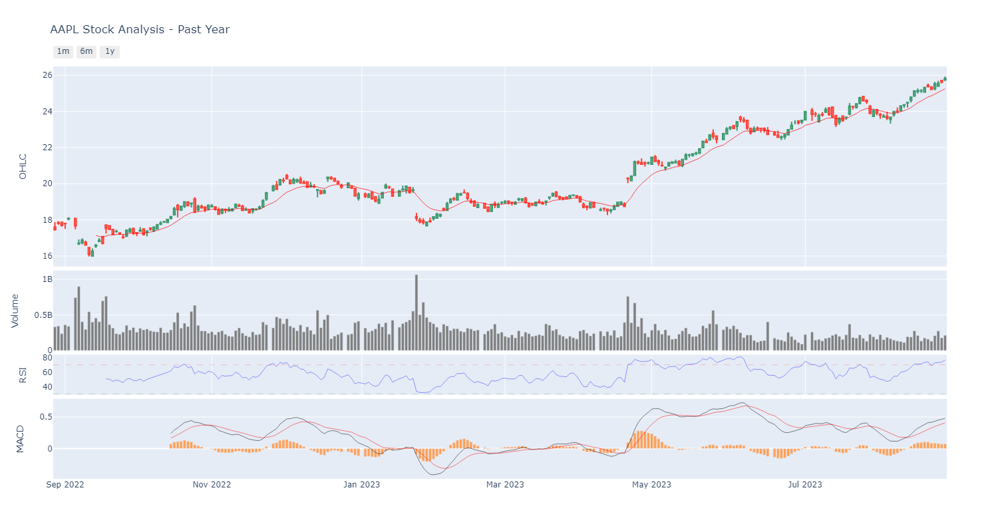
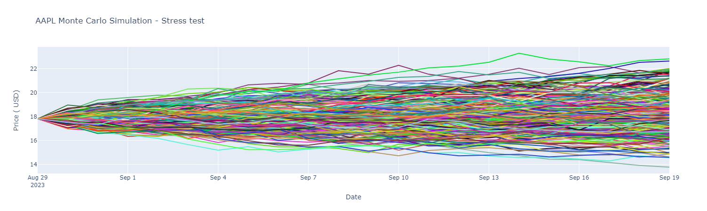

# Financial Analysis and Monte Carlo stress test

# Overview:
Stock values are inherently volatile and any financial analysis show be done carefully when assessing trading strategies. 
In this project we aimed at summarizing main financial indicators, namely:
- **Open-High-Low-Close Chart** is a bar chart that shows open, high, low and closing prices for each trading day. This 
type of chart is helpful at detecting increasing or decreasing momentum.
- **Volume of stocks** traded on a given day.
- **Relative Strength Index**, which measures recent price changes. RSI levels below 30 indicate that the stock is being 
oversold or is undervalued, and thus it signals to buy. High RSI levels, above 70, 
suggest the opposite as the stock is overbought or overvalued.
- **Moving Average Convergence/Divergence** is a trend-following momentum that shows the relationship between 
two exponential moving averages. The MACD line is calculated subtracting the 26-period EMA from the 12 period EMA. 
A 9-day EMA of the MACD line is called the signal line, which is a trigger for buy or sell signals. The MACD generates a 
buy signal when it moves above its own 9-day EMA, a bullish signal, and sends a sell signal when it moves below its 9-day EMA.

A Monte Carlo Stress Test was also performed to assess the volatility in extreme scenarios.

# Goals:
Build a plotly Dash App to dynamically show all of the above financial metrics for a selection of 50 individual stocks from S&P500.